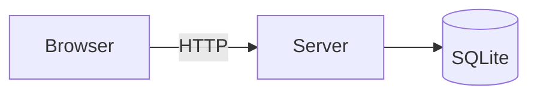

# Dire Mux Mermaid diagrams

The Dire Mux Pi Native pane renders fenced ```mermaid code blocks in assistant messages as diagrams. Write standard Mermaid syntax inside the fence; no tools, files, or extra setup are involved.

````markdown

````

## Rules

- Emit the fence in a normal assistant message. Diagrams are for communicating with the user; do not write them into project files unless asked.
- Keep one diagram per fence and keep it focused. Roughly 25 nodes or fewer stays readable in the timeline; split larger systems into several diagrams.
- Invalid syntax falls back to showing the raw source as a code block, so double-check the diagram parses. Common pitfalls:
  - Quote labels containing spaces, parentheses, or punctuation: `A["parse(input)"]`, `-->|"on error"|`.
  - Node IDs must not contain spaces; put readable text in the bracketed label.
  - Start the block with a valid diagram type keyword (`flowchart`, `sequenceDiagram`, `stateDiagram-v2`, `classDiagram`, `erDiagram`, `gantt`, `pie`, `journey`, `timeline`, `mindmap`).
- Do not use HTML tags, links, or `click` interactions in labels; the pane renders with Mermaid's strict security level, which ignores or rejects them.
- Prefer `flowchart` for architecture and control flow, `sequenceDiagram` for request or message ordering, `stateDiagram-v2` for lifecycles, `erDiagram` for data models, and `classDiagram` for type relationships.
- The pane themes diagrams automatically; do not add `%%{init: ...}%%` theme directives or hard-coded colors unless the user asks for specific styling.
- Pair every diagram with a sentence or two of prose; the diagram supports the explanation, it does not replace it.
